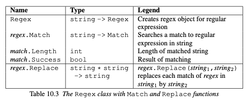

Regex, or *regular expressions* as they are also called, are expressions that takes somekind of pattern into account. 
In order to use them in F# then we have the following:

Here are also a list of functions that can be used to either just parse one or more types of the regex provided:

# Parsing nested data
Here is an example from the book of parsing nested data that can be useful. This is what it is trying to parse:

In order to do so a regular expression is needed:

This is the result of the parsing:

However, it is better to parse using a [[lectures.lecture7.parser]] that is monadic. 

## Lecture
This is the way we did it in the lecture:

